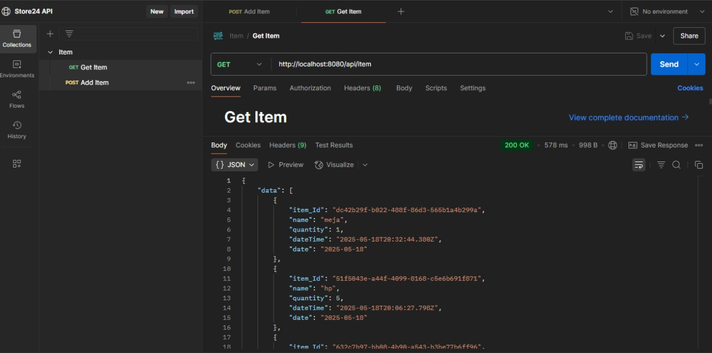
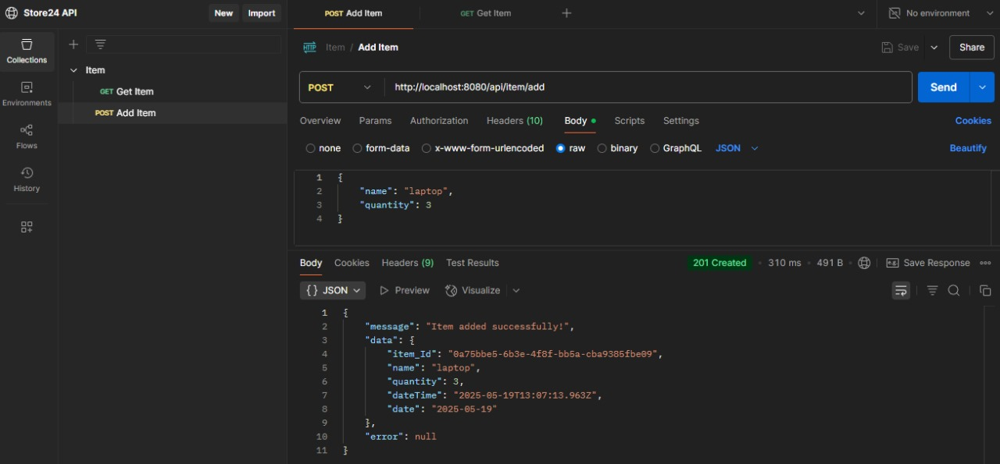
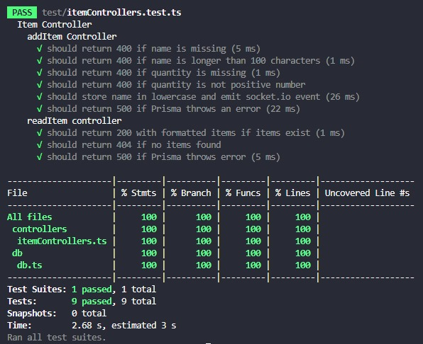
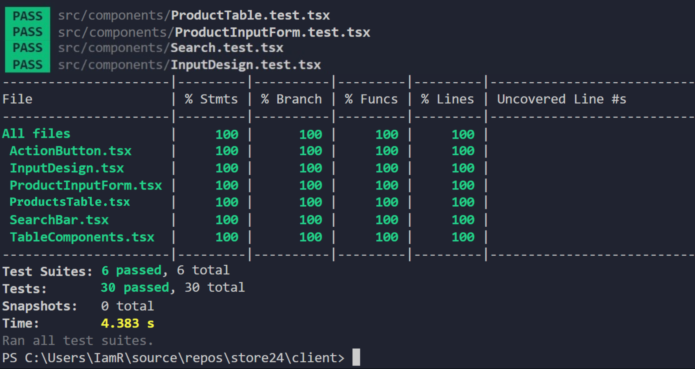

<p align="center">
 
</p>
<p align="center">
 
 <h2 align="center">Reveal of Our Website</h2>
 <p align="center">Great inventory management is not about having more. It's about knowing more</p>
</p>
<p align="center">
    <a href="https://github.com/ranisedangbekerja/store24/graphs/contributors">
       
    </a>
</p>

<p align="center">
 <p align="center"> Store24 adalah Website yang sistem pergudangan yang dapat digunakan untuk mempermudah inventarisasi barang di gudang 🏬 </p>
 <p align="center">Website kami hanya diperuntukkan untuk uji coba melakukan testing 📝</p>
</p>

## Docummentation ✍️
[PPT](https://docs.google.com/presentation/d/1DQ_MtBFeB1iJCd_EfT3ndgKKE2uFU9X9GoP5wlxMUqA/edit?usp=sharing)


## Task Brief 🌱

* Dalam tugas ini, setiap kelompok yang telah dibagi sebelumnya diminta untuk membuat sebuah website dengan Tema "Sistem Pergudangan (STR02)" dan melakukan testing, baik dengan Whithe-Box Testing maupun Black-Box Testing.

* Selain itu, peserta diwajibkan menggunakan panduan resmi tentang git dalam proses pengerjaan, termasuk cara melakukan commit dan merge dengan baik dan benar. Seluruh proses kerja akan dinilai dari repository GitHub tersebut.

## About Ladang Lokal
Website ini dibuat untuk memenuhi tugas mata kuliah Pengujian Perangkat Lunak Web Departemen Teknik Elektro dan Teknologi Informasi Universitas Gadjah Mada tahun ajaran 2024/2025 🏫

## Acceptance Criteria 🌱 
1.  1st Feature : Menampilkan 10 Produk Terbaru

    * AC 1.1 : Sistem menampilkan maksimal 10 entri terbaru yang diurutkan berdasarkan tanggal pencatatan.
    * AC 1.2 : Setiap entri menampilkan nama, jumlah, dan tanggal pencatatan produk.
    * AC 1.3 : Setelah pengguna menambahkan produk baru, daftar langsung diperbarui tanpa refresh halaman.
    * AC 1.4 : Daftar produk harus konsisten dan tidak berubah walaupun halaman direfresh.

3. 2nd Feature : Menambahkan Produk Baru

   * AC 2.1 : Sistem menampilkan formulir input setelah pengguna menekan tombol “Add Product”.
   * AC 2.2 : Formulir input menampilkan field nama, jumlah, dan tanggal pencatatan produk.
   * AC 2.3 : Pengguna wajib mengisi field nama produk dan tidak melebihi 100 karakter.
   * AC 2.4 : Pengguna wajib mengisi field jumlah produk dan tidak bernilai negatif.
   * AC 2.5 : Jika pengguna melakukan kesalahan saat mengisi formulir input, maka pesan error harus ditampilkan sesuai dengan kesalahan yang dilakukan.
   * AC 2.6 : Saat pengguna menekan tombol “Save Product”. Sistem akan menampilkan pesan “Product Successfully Added” dan menyimpan entri ke database, halaman dashboard ditampilkan, dan 10 produk baru diperbarui.


## Features 💼 
1. Melihat Produk

   Pengguna dapat melihat produk pada dashboard, dashboard akan berisi 10 produk terbaru yang telah ditambahkan. Jika telah melebihi 10 produk akan menuju page selanjutnya yang dapat di akses dengan button "Next' ⏭️

2. Menambahkan Produk

   Pengguna dapat menambahkan produk dengan kriteria berikut:
   * Nama barang tidak boleh lebing dari 100 karakter.
   * Jumlah barang tidak boleh kurang dari samadengan 0, sehingga jumlah produk terendah adalah 1.
3. Mencari Produk

   Pengguna dapat melakukan pencarian produk berdasarkan nama dengan menggunakan fitur "Search Bar". 
4. Filter Produk

   Pengguna dapat melakukan pencarian produk dengan menggunakan filter berikut:
   * Berdasarkan tanggal
   * Berdasarkan jumlah barang terendah
   * Berdasarkan jumlah barang terbanyak

## Screenshot Hasil API Test
<p align="center">
 
</p>
<p align="center">
 
</p>

## Screenshot Coverage Test
1. Back-End 
<p align="center">
 
</p>
2. Front-End
<p align="center">
 
</p>

## Next.js Project 


This is a [Next.js](https://nextjs.org) project bootstrapped with [`create-next-app`](https://nextjs.org/docs/app/api-reference/cli/create-next-app).

## Other Tools
 

## Getting Started

First, run the development server:

```bash
npm run dev
# or
yarn dev
# or
pnpm dev
# or
bun dev
```

Open [http://localhost:3000](http://localhost:3000) with your browser to see the result.

You can start editing the page by modifying `app/page.tsx`. The page auto-updates as you edit the file.

This project uses [`next/font`](https://nextjs.org/docs/app/building-your-application/optimizing/fonts) to automatically optimize and load [Geist](https://vercel.com/font), a new font family for Vercel.

## Learn More

To learn more about Next.js, take a look at the following resources:

- [Next.js Documentation](https://nextjs.org/docs) - learn about Next.js features and API.
- [Learn Next.js](https://nextjs.org/learn) - an interactive Next.js tutorial.

You can check out [the Next.js GitHub repository](https://github.com/vercel/next.js) - your feedback and contributions are welcome!

#

<hr>
<p align="center">
Developed by Kelompok 2 with ❤️ in Indonesia (IDN)
</p>
